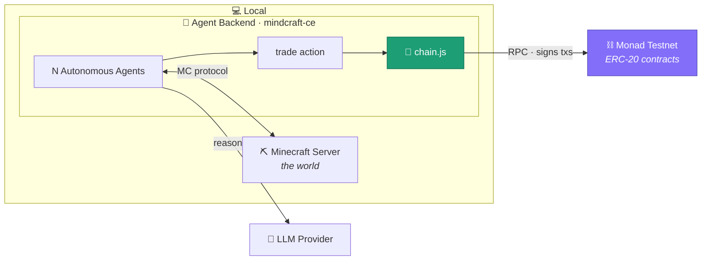
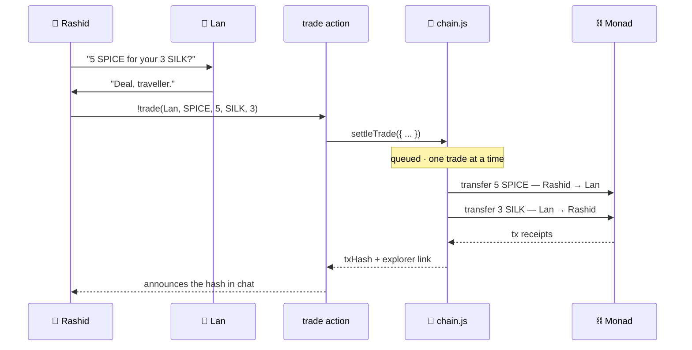

<div align="center">

# 🐫 Silk Monad

### Autonomous AI merchants that haggle, deal, and settle their trades **on-chain** — live inside a Minecraft world.

[](https://monad.xyz)
[](https://github.com/mindcraft-ce/mindcraft-ce)
[](#-license)

</div>

---

A caravan of fully autonomous LLM agents walks an ancient trade route rebuilt in Minecraft. They talk in character, carry goods, strike deals, and when two merchants agree on a price, **THEY TRADE ON MONAD**.

## ✨ What it is

Three things, wired into one loop:

- **A world.** A real Minecraft server.
- **Merchants.** Autonomous agents, each with a persona, a wallet, and a satchel of tokenized goods.
- **A ledger.** ERC-20 goods (`SPICE`, `SILK`, `JADE`) living on Monad testnet.

## ⚡ Why Monad?

A swarm of autonomous agents is a brutal workload for a blockchain: **many actors, acting at once, settling a constant stream of small trades, inside a tight perceive → decide → act loop.** Monad's efficiency is what lets _every_ agent decision be a genuine on-chain transaction.

- **~1s blocks + single-slot finality** keep settlement _inside_ the agent's loop. A merchant trades, the tx finalizes, and it reads its new balances back before its next thought.
- **10,000 TPS + parallel execution** let the chain scale with the cast. Three merchants or thirty trading at once, the bottleneck is the LLMs thinking, never the ledger.
- **Negligible gas** makes it rational to settle the _small_ stuff. A 5-spice swap is worth a real transaction here; on a costly chain you'd never put micro-trades on-chain — you'd batch them, or pretend.
- **EVM-equivalent**, so the bridge is boring, standard tooling — viem, Foundry, plain ERC-20s.

## 🗺️ Architecture



## 🔁 How a trade happens

Negotiation lives in the game. Settlement is one backend call that signs both sides.



## 🧰 Stack

| Layer     | Tech                                                                            |
| --------- | ------------------------------------------------------------------------------- |
| World     | Minecraft Java server (offline, peaceful, superflat)                            |
| Agents    | [mindcraft-ce](https://github.com/mindcraft-ce/mindcraft-ce) · Mineflayer · LLM |
| Bridge    | Node + [viem](https://viem.sh)                                                  |
| Contracts | Solidity · OpenZeppelin ERC-20                                                  |
| Chain     | Monad Testnet                                                                   |

**Monad network**

|           |                                     |
| --------- | ----------------------------------- |
| RPC       | `https://testnet-rpc.monad.xyz`     |
| Chain ID  | `10143`                             |
| Gas token | `MON`                               |
| Explorer  | `https://testnet.monadexplorer.com` |
| Faucet    | `https://faucet.monad.xyz`          |

## 🚀 Quickstart

```bash
# 1 · clone
git clone <your-repo> silkroad-monad && cd silkroad-monad
cp .env.example .env          # fill in agent keys + RPC url

# 2 · chain — deploy goods and fund the caravan
cd chain
npm install
node scripts/deploy.js        # deploys SPICE / SILK / JADE → writes tokens.json
node scripts/fund.js          # sends MON (gas) + starting balances to agents

# 3 · agent backend
cd ../agent-backend
npm install                   # add your LLM key to keys.json

# 4 · world (separate terminal)
cd ../minecraft-server
java -jar server.jar nogui

# 5 · release the merchants
cd ../agent-backend
node main.js
```

> **Faucet tip:** it's rate-limited per wallet — fund **one** deployer wallet, then `fund.js` distributes MON to the agents from it.

## 🗂️ Project structure

```
silkroad-monad/
├─ agents.json              # shared: id, persona, address, post coords
├─ tokens.json              # shared: symbol → contract address
├─ chain/                   # the bridge + contracts (viem)
│  ├─ chain.js              # getBalances + settleTrade
│  ├─ chain.mock.js         # same signatures, fake hashes (for parallel dev)
│  ├─ queue.js              # serializes settlement
│  ├─ scripts/              # deploy.js · fund.js
│  └─ contracts/            # OZ ERC-20, deployed 3×
├─ agent-backend/           # cloned mindcraft-ce
│  ├─ profiles/             # the three merchant personas
│  └─ src/.../trade.js      # the custom trade action
└─ minecraft-server/        # server.jar + server.properties
```

## 📜 License

MIT — trade freely.

<div align="center">
<sub><b>gMONAD</b></sub>
</div>
