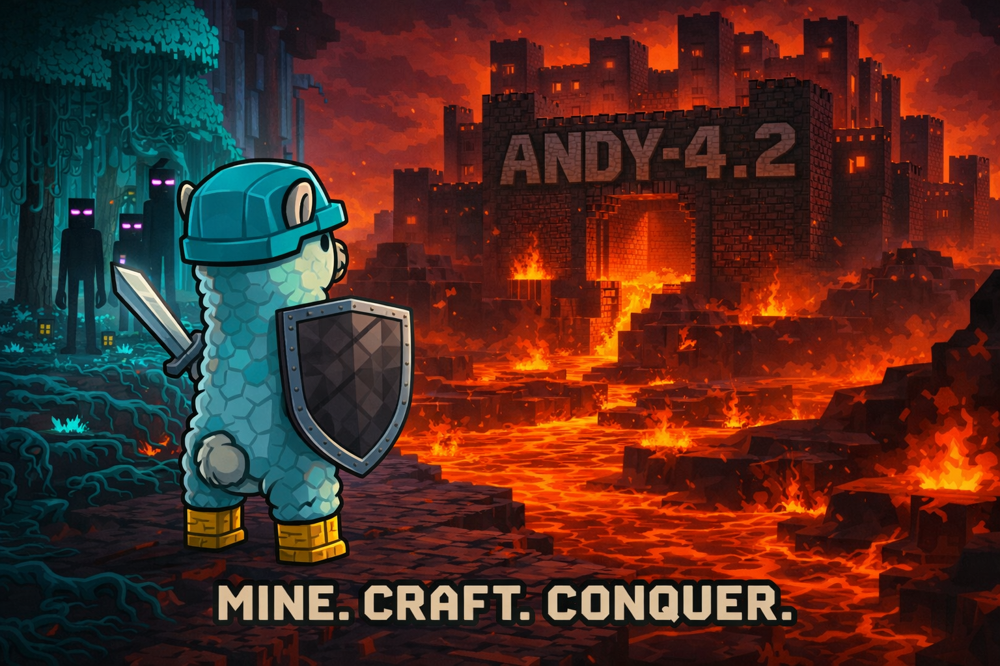

---
hide:
  - navigation
---

<h1 align="center">Andy Model Family</h1>

Open-source AI models built specifically for Minecraft. Recommended to run locally with [LM Studio](https://www.lmstudio.ai/).

Browse all models on the [Mindcraft-CE Hugging Face page](https://huggingface.co/collections/Mindcraft-CE).

---

## Andy-4.2 Models

### 🧠 Andy-4.2

A 9B-parameter multimodal specialist built on the Qwen3.5 architecture with Gated Deltanet attention. Features vision and DeepSeek-R1 style chain-of-thought reasoning. The first local model capable of obtaining a full diamond armour set with zero human interaction.

| Spec | Value |
|---|---|
| Parameters | 9 Billion |
| Architecture | Qwen3.5 |
| Context Length | Up to 1,000,000 tokens |
| Dataset | 2,748 examples |
| Training Time | 5 hours |
| Hardware | 1x NVIDIA RTX 3090 |

[Download on Hugging Face](https://huggingface.co/Mindcraft-CE/Andy-4.2)

---

### 💨 Andy-4.2 Air

A 4B-parameter variant of Andy-4.2, sharing the same Qwen3.5 architecture and vision capabilities with a smaller footprint. Also capable of obtaining full diamond armour autonomously.

| Spec | Value |
|---|---|
| Parameters | 4 Billion |
| Architecture | Qwen3.5 |
| Context Length | Up to 1,000,000 tokens |
| Dataset | 2,748 examples |
| Training Time | 3 hours |
| Hardware | 1x NVIDIA RTX 3090 |

[Download on Hugging Face](https://huggingface.co/Mindcraft-CE/Andy-4.2-Air)

---

### 🤏 Andy-4.2 Micro

An ultra-lightweight 800M-parameter variant with GGUF support, optimized for maximum efficiency on constrained hardware. Shares the Qwen3.5 architecture, vision, and CoT reasoning of the Andy-4.2 family.

| Spec | Value |
|---|---|
| Parameters | 800 Million |
| Architecture | Qwen3.5 |
| Context Length | Up to 256,000 tokens |
| Dataset | 2,748 examples |
| Training Time | 30 minutes |
| Hardware | 1x NVIDIA RTX 3090 |

[Download on Hugging Face](https://huggingface.co/Mindcraft-CE/Andy-4.2-Micro)

---

## Previous Models

### 🧠 Andy-4.1

A 3B-parameter multimodal specialist built on a modified Qwen3 VL architecture. The first Andy model with vision understanding and DeepSeek-R1 style chain-of-thought reasoning. Trained on 130,000 examples in just 42 hours.

| Spec | Value |
|---|---|
| Parameters | 3 Billion |
| Architecture | Modified Qwen3 VL |
| Context Length | Up to 256,000 tokens |
| Dataset | 130,000 examples |
| Training Time | 42 hours |
| Hardware | 1x NVIDIA RTX 3090 |

[Download on Hugging Face](https://huggingface.co/Mindcraft-CE/Andy-4.1)

---

### 🧠 Andy-4

An 8B-parameter specialist model trained for advanced reasoning and robust in-game decision-making. Trained on a single RTX 3090 over three weeks.

| Spec | Value |
|---|---|
| Parameters | 8 Billion |
| Base Model | Llama-3.1-8B |
| Tokens Trained | 42 Million |
| Hardware | 1x NVIDIA RTX 3090 |

**VRAM Requirements**

| Quantization | VRAM |
|---|---|
| F16 | 20 GB+ *(broken, do not use)* |
| Q8_0 | 12 GB+ |
| Q5_K_M | 8 GB+ |
| Q4_K_M | 8 GB |
| Q2_K | 6 GB |

[Download on Hugging Face](https://huggingface.co/Sweaterdog/Andy-4) · [Ollama](https://ollama.com/Sweaterdog/Andy-4)

---

### 🤏 Andy-4-micro

A lightweight 1.5B-parameter variant, optimized for responsive local inference on constrained hardware. Trained on a single RTX 3070 over four days.

| Spec | Value |
|---|---|
| Parameters | 1.5 Billion |
| Base Model | Qwen-2.5-1.5B |
| Tokens Trained | 42 Million |
| Hardware | 1x NVIDIA RTX 3070 |

**VRAM Requirements**

| Quantization | VRAM |
|---|---|
| F16 | 6 GB |
| Q8_0 | 6 GB |
| CPU | Capable |
| Q5_K_M | 4 GB |
| Q3_K_M | 2 GB |

[Download on Hugging Face](https://huggingface.co/Sweaterdog/Andy-4-micro) · [Ollama](https://ollama.com/Sweaterdog/Andy-4:micro-q8_0)
